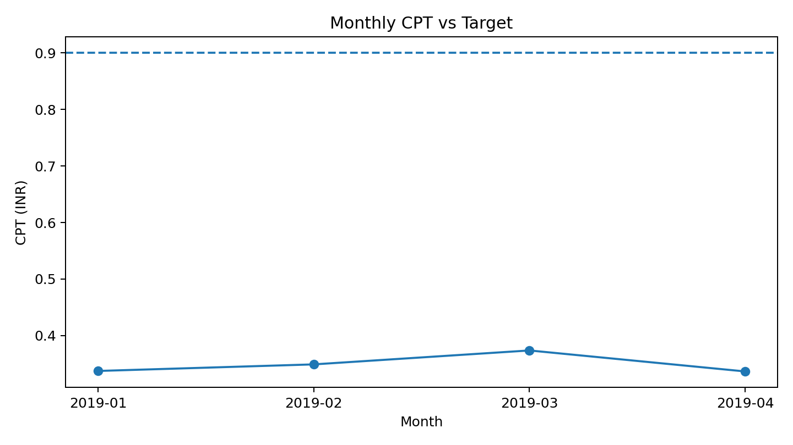
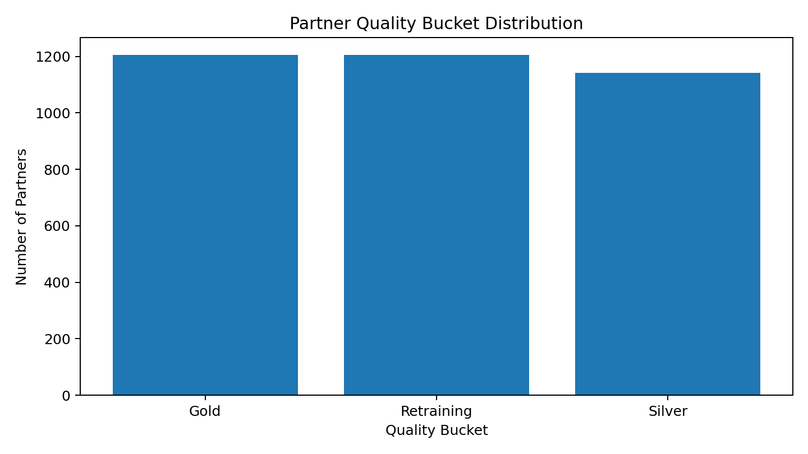

# Performance Improvement Program – Delivery Partner Strategy

## Project Overview

This project is a Business Analyst / Strategy case study for a hyperlocal delivery platform.

The case has two objectives:

1. Design a simple Partner Benefit Program that increases delivery-partner availability while keeping Cost per Completed Task (CPT) below ₹0.90.
2. Design a Partner Quality Framework that identifies low-performing partners and defines a retraining process.

## Dataset

The supplied workbook contains two sheets:

- **Sheet1:** 36,313 partner-day records covering January–April 2019.
- **Sheet2:** 3,553 partner-level performance records for a particular week.

## Part 1 – Benefit Program

### Point Structure

| Daily Supply Hours | Base Points |
|---|---:|
| < 4 hours | 0 |
| 4–<8 hours | 4 |
| 8–<12 hours | 8 |
| 12+ hours | 12 |

### Demand Multipliers

| Day | Multiplier |
|---|---:|
| Sunday | 1.50x |
| Monday | 1.50x |
| Friday | 1.25x |
| Saturday | 1.25x |
| Tuesday–Thursday | 1.00x |

### Consistency Bonus

Partners active on **5 or more days in a calendar week** receive **10 additional points**.

### Point Value

**1 point = ₹0.50**

This structure is deliberately simple because the target partner population earns approximately ₹20,000–₹30,000 per month.

## Part 1 – Budget Result

| Month | Completed Tasks | Incentive Cost (₹) | CPT (₹) |
|---|---:|---:|---:|
| 2019-01 | 86,825 | 29,303.50 | 0.338 |
| 2019-02 | 103,865 | 36,263.00 | 0.349 |
| 2019-03 | 112,178 | 41,928.00 | 0.374 |
| 2019-04 | 119,677 | 40,289.50 | 0.337 |

**Overall CPT:** ₹0.350

**Maximum monthly CPT:** ₹0.374

**Required maximum CPT:** ₹0.90

The proposed model therefore remains below the required CPT ceiling across all four months.



## Part 2 – Partner Quality Model

The quality model uses all eight supplied performance metrics.

| Metric | Weight | Threshold |
|---|---:|---|
| Acceptance Rate | 15 | ≥ 90% |
| Cancellation Rate | 15 | ≤ 2% |
| Tasks Not Delivered | 15 | ≤ 1% |
| Partner Cancellation | 10 | ≤ 1% |
| Task Time | 15 | ≤ 45 min |
| Interaction Rate | 10 | ≤ 40% |
| Contact Rate | 5 | ≤ 15% |
| Rating | 15 | ≥ 4.7 |

Each metric contributes its full weight when the partner meets the threshold and zero when the threshold is missed. This creates a transparent and explainable scorecard.

### Partner Buckets

- **Gold:** ≥85
- **Silver:** 70–84
- **Retraining:** <70

Partners entering the retraining bucket receive root-cause analysis and targeted refresher training. Repeated underperformance triggers progressively stronger interventions.



## Retraining Escalation

1. **First occurrence:** root-cause analysis + refresher training + 1-week monitoring.
2. **Second occurrence:** one-to-one coaching + 2-week improvement plan.
3. **Third occurrence:** formal Performance Improvement Plan (PIP) + manager review.
4. **Repeated failure:** operational/contract review according to company policy.

## Key Business Insights

- Incentives should be strongest when supply is most valuable.
- A consistency bonus prevents the program from becoming weekend-focused.
- CPT should be monitored monthly rather than only at program launch.
- Quality scoring should be transparent enough for partners and operations managers to understand.
- Retraining should address root causes rather than treating every low score identically.

## Repository Structure

```text
Performance_Improvement_Program/
├── README.md
├── data/
│   └── Partner_Data.xlsx
├── analysis/
│   ├── monthly_budget_summary.csv
│   ├── overall_budget_summary.csv
│   ├── partner_quality_bucket_summary.csv
│   ├── partner_quality_scored.csv
│   └── weekly_consistency_bonus.csv
├── images/
│   ├── monthly_cpt_vs_target.png
│   └── partner_quality_buckets.png
├── report/
│   └── Performance_Improvement_Program_Report.md
└── presentation/
    └── Presentation_Outline.md
```

## Tools Used

- Microsoft Excel
- Python / Pandas
- Data analysis
- KPI design
- Business rules
- Cost modelling
- Partner segmentation
- Strategy / operations analysis

## Author

**Ganga Ramya Sri**  
Business Analyst / Data & Operations Analytics Portfolio
